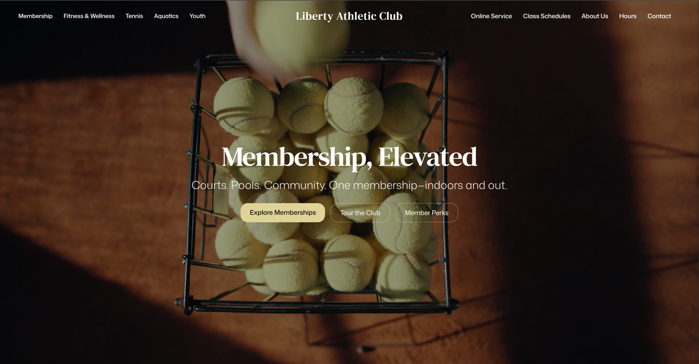

  

<h1 align="center">
  Hi, I'm Ryan 👋
  
</h1>

  <b>Software Engineer • Full-Stack Developer • Automotive Technology Enthusiast</b>

  
  University of Michigan Computer Science Graduate
  
  

  

---

### 🚀 About Me

- 💻 Recent Computer Science graduate from the University of Michigan, Ann Arbor
- ⚡ Passionate about building immersive frontend experiences and production-style full-stack systems
- 🏎️ Interested in automotive software, telemetry dashboards, infotainment UI, and performance-focused design
- ✨ Built modern platforms using React, Next.js, TypeScript, Prisma, PostgreSQL, Clerk, GSAP, and TailwindCSS
- 🧠 Strong focus on combining engineering, architecture, and visual design into polished user experiences
---

## Tech Stack

Frontend:
React • Next.js • TypeScript • TailwindCSS • GSAP

Backend:
Node.js • Express • Prisma • PostgreSQL

Tools:
Clerk • Vercel • Neon • Firebase • Git • Figma

  
  
  
  
  
  

---

### 💻 Featured Project: Liberty Website

  

  

> **Tech Stack:** React • Vite • TailwindCSS • GSAP • Sanity.io • Vercel  
>
> Built a fully responsive website for Liberty Athletic Club with scroll-based motion design and a live CMS.  
> Staff can update trainer bios, images, and descriptions directly through Sanity Studio — no code changes required.

---

### 🌐 Connect With Me  

  

  

---

## Currently Building

- Liberty POS — Full-stack athletic club cafe/POS platform
- Automotive telemetry dashboards and racing-inspired UI systems
- Modern React/Next.js frontend experiences

---
